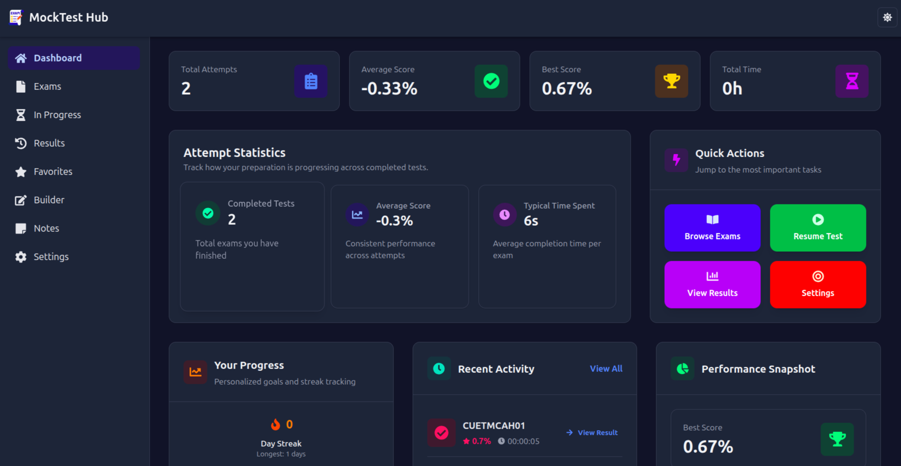

# MockTest Hub


> Offline-first, blazing-fast mock exam platform for competitive exams.



Table of contents

- [Features](#features)
- [Tech stack](#tech-stack)
- [Quick start](#quick-start)
- [Build & preview](#build--preview)
- [Scripts](#scripts)
- [Project structure](#project-structure)
- [Contributing](#contributing)
- [License](#license)
- [Author](#author)

## Features

- Offline-first: data is stored locally for instant access and offline usage
- Realistic exam simulation: timers, mark-for-review, and progress saving
- Detailed analytics: charts, attempt history, and section-wise breakdowns
- Keyboard shortcuts for quick navigation
- Responsive, modern UI built with Tailwind CSS

## Tech stack

- Frontend: React + TypeScript
- State management: Zustand
- Routing: React Router
- Charts: Recharts
- Build tool: Vite
- Persistence: LocalStorage / IndexedDB (optimized)

## Quick start

Clone, install, and run the dev server:

```bash
git clone https://github.com/AdithSuresh2004/mocktest-hub.git
cd mocktest-hub
npm install
npm run dev
# Open http://localhost:5173 in your browser
```

### Build & preview

```bash
npm run build
npm run preview
# Preview is typically available at http://localhost:4173
```

## Scripts

Common scripts you may use:

```text
npm run dev        # Start Vite dev server
npm run build      # Build for production
npm run preview    # Preview production build locally
npm run generate   # Generate & validate exam manifests
npm run lint       # Run ESLint and auto-fix issues
npm run format     # Format code with Prettier
npm run type-check # Run TypeScript checks
```

Check `package.json` for the full list of scripts and their exact definitions.

## Project structure

```text
mocktest-hub/
├─ public/      # static assets (images, exam JSON, manifest)
├─ src/         # source code (components, pages, hooks, services)
│  ├─ components/
│  ├─ hooks/
│  ├─ pages/
│  └─ stores/
├─ scripts/     # manifest generation/validation scripts
├─ package.json
└─ README.md
```

## Contributing

Contributions, bug reports, and suggestions are very welcome.

1. Fork the repository
2. Create a feature branch: `git checkout -b feature/awesome`
3. Commit your changes with a clear message
4. Open a Pull Request describing your change

If you modify or add exam JSON files, run the manifest script to keep the app in sync:

```bash
npm run generate
```

## License

This project is licensed under the MIT License — see the [LICENSE](LICENSE) file for details.

## Author

[Adith Suresh](https://github.com/AdithSuresh2004)

---

Happy studying! 🎓
